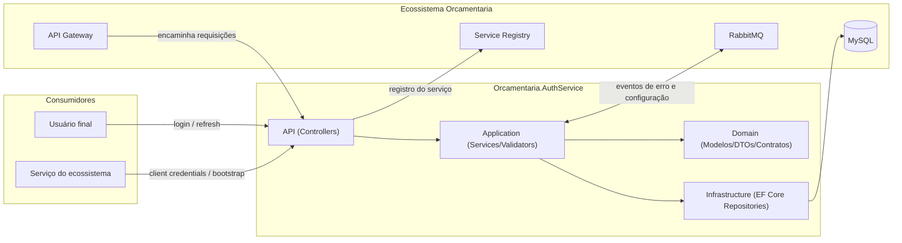
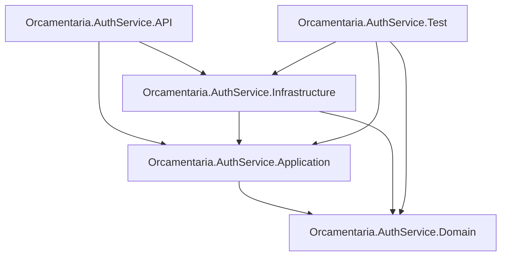

# 🔐 Orcamentaria.AuthService

Serviço de **autenticação e autorização** do ecossistema de microsserviços **Orcamentaria**. Emite e valida tokens **JWT (RS256)** para usuários e para serviços (incluindo um fluxo de **bootstrap** para provisionamento inicial de credenciais), e gerencia usuários, permissões e serviços cadastrados, persistindo os dados em **MySQL**.

---

## 🎯 Objetivo

Em um ecossistema de microsserviços, cada chamada entre serviços e cada ação de um usuário final precisa ser autenticada e autorizada de forma consistente. O `Orcamentaria.AuthService` centraliza essa responsabilidade:

1. Autentica **usuários** por e-mail/senha e emite um par de tokens (acesso + refresh) assinados com uma chave RSA dedicada a usuários;
2. Autentica **serviços** por `clientId`/`clientSecret` e emite um token assinado com uma chave RSA dedicada a serviços;
3. Suporta um fluxo de **bootstrap**, no qual um serviço recebe um segredo de uso único/temporário para obter, sem credenciais fixas, um token de escopo restrito (leitura de configuração);
4. Gerencia o cadastro de **usuários**, **serviços** e **permissões**, incluindo a associação/remoção de permissões a usuários;
5. Expõe, por meio de claims de `role`, o conjunto de permissões de cada usuário/serviço, para que os demais serviços do ecossistema apliquem autorização (`[Authorize(Roles = "...")]`) localmente a partir do token emitido aqui.

---

## 🧰 Tecnologias

| Tecnologia | Versão | Finalidade |
|---|---|---|
| C# / .NET | 9 | Linguagem e runtime da aplicação |
| ASP.NET Core Web API | `Microsoft.NET.Sdk.Web` | Hospedagem HTTP |
| Microsoft.AspNetCore.Authentication.JwtBearer | 9.0.11 | Validação de tokens JWT (esquemas `userJwt`, `serviceJwt`, `bootstrapJwt`) |
| Microsoft.EntityFrameworkCore | 9.0.11 | ORM |
| MySql.EntityFrameworkCore | 9.0.9 | Provider EF Core para MySQL |
| System.IdentityModel.Tokens.Jwt / Microsoft.IdentityModel.Tokens | 8.14.0 | Geração e assinatura de tokens JWT com RSA (RS256) |
| AutoMapper | 16.2.0 | Mapeamento entre entidades de domínio e DTOs |
| FluentValidation | 12.1.0 (via `Orcamentaria.Lib.Domain`) | Validação de entidades (`User`, `Service`, `Permission`) e de senha |
| Microsoft.AspNetCore.Mvc.Versioning | 5.1.0 | Versionamento de API (`api/v1/...`) |
| RabbitMQ.Client | 7.2.0 | Publicação de eventos de erro e configuração em tempo real |
| `Orcamentaria.Lib.Domain` | 10.1.1 | Modelos, enums, exceptions, contextos de autenticação e contratos compartilhados |
| `Orcamentaria.Lib.Application` | 2.1.4 | Implementações compartilhadas (HTTP client, Service Registry, RSA, cache) |
| `Orcamentaria.Lib.Infrastructure` | 5.4.0 | Composição de serviços e middlewares comuns (autenticação, Swagger, CORS, tratamento de erro) |
| xUnit / Moq / Moq.AutoMock / `Orcamentaria.Lib.Test` | — | Stack de testes unitários (`Orcamentaria.AuthService.Test`) |
| coverlet.collector | 10.0.1 | Coleta de cobertura de testes |

---

## 🏗️ Arquitetura

O projeto segue uma **arquitetura em camadas**, apoiada na biblioteca interna compartilhada `Orcamentaria.Lib`, que concentra a infraestrutura transversal do ecossistema (autenticação, Swagger, CORS, mensageria, middlewares, contexto de requisição).

- **Domain**: modelos (`User`, `Service`, `Permission`, `Bootstrap`), DTOs, mappers (AutoMapper `Profile`), contratos de repositório e de serviço — sem dependência de frameworks web ou de acesso a dados.
- **Application**: regras de negócio (`AuthenticationService`, `UserService`, `ServiceService`, `PermissionService`, `BootstrapService`, `PasswordService`), os serviços de geração/validação de token (`ITokenService<T>`) e os validadores (`FluentValidation`).
- **Infrastructure**: `MySqlContext` (EF Core), `IEntityTypeConfiguration` de cada entidade e os repositórios concretos, todos derivando de `BaseRepository<T>` da `Orcamentaria.Lib.Infrastructure`.
- **API**: Controllers versionados (`api/v1/...`), composição de injeção de dependência (`Startup.cs`) e as chaves RSA (`Keys/*.pem`) usadas para assinar/validar os tokens.

Fluxo de dependência entre camadas: `API → Application/Infrastructure → Domain`, sempre apontando para dentro.

A infraestrutura comum (`services.ResolveCommonServicesWithMySql<MySqlContext>(...)` / `app.ConfigureCommon(...)`, em `Orcamentaria.Lib.Infrastructure`) é quem registra:
- os três esquemas de autenticação JWT (`userJwt`, `serviceJwt`, `bootstrapJwt`), escolhidos dinamicamente conforme a claim `token_use`/`aud` do token recebido;
- o `AuthMiddleware`, que popula `IUserAuthContext`/`IServiceAuthContext` a partir das claims do token autenticado;
- o `ErrorHandlingMiddleware`, que centraliza o tratamento de exceptions de negócio;
- o `RequestMiddleware`, responsável pela correlação de requisições (`RequestId`/`RequestOrderId`);
- Swagger/OpenAPI, CORS e o `DbContext` do MySQL.

---

## 📁 Estrutura do Projeto

```text
Orcamentaria.AuthService/
├── Orcamentaria.AuthService.API/                 # Apresentação HTTP (composition root)
│   ├── Controllers/v1/
│   │   ├── AuthenticationController.cs           #   Autenticação de usuário, serviço e bootstrap
│   │   ├── UserController.cs                     #   CRUD de usuários e gestão de permissões do usuário
│   │   ├── ServiceController.cs                  #   CRUD de serviços e rotação de credenciais
│   │   ├── PermissionController.cs                #   CRUD de permissões
│   │   └── BootstrapController.cs                 #   Geração/revogação de bootstrap secret
│   ├── Keys/                                      #   Chaves RSA (pública/privada) para assinatura JWT de usuário e serviço
│   ├── Program.cs / Startup.cs                    #   Bootstrap e injeção de dependências
│   └── appsettings*.json                          #   Configuração da aplicação
├── Orcamentaria.AuthService.Application/          # Regras de negócio
│   ├── Services/AuthenticationService.cs          #   Orquestra os fluxos de autenticação
│   ├── Services/UserService.cs, ServiceService.cs, PermissionService.cs, BootstrapService.cs
│   ├── Services/PasswordService.cs                #   Hash (PBKDF2) e validação de senha
│   ├── Services/UserTokenService.cs, UserRefreshTokenService.cs         # ITokenService<User>
│   ├── Services/ServiceTokenService.cs, ClientIdTokenService.cs, ClientSecretTokenService.cs # ITokenService<Service>
│   ├── Services/BootstrapTokenService.cs, BootstrapSecretTokenService.cs # ITokenService<Service>/<Bootstrap>
│   ├── Validators/                                #   UserValidator, ServiceValidator, PermissionValidator, PasswordValidator
│   └── Providers/TokenProvider.cs                 #   ITokenProvider usado pela própria API para se autenticar como serviço
├── Orcamentaria.AuthService.Domain/               # Contratos e modelos
│   ├── Models/User.cs, Service.cs, Permission.cs, Bootstrap.cs
│   ├── DTOs/User, Service, Permission, Bootstrap
│   ├── Mappers/UserMapper.cs, ServiceMapper.cs, PermissionMapper.cs (AutoMapper Profile)
│   ├── Repositories/I*Repository.cs
│   └── Services/I*Service.cs, ITokenService.cs
├── Orcamentaria.AuthService.Infrastructure/       # Acesso a dados
│   ├── Contexts/MySqlContext.cs                   #   DbContext (Users, Services, Permissions, Bootstraps)
│   ├── Configurations/                            #   IEntityTypeConfiguration de cada entidade (Fluent API)
│   └── Repositories/                              #   Implementações concretas (EF Core)
├── Orcamentaria.AuthService.Test/                 # Testes unitários (xUnit + Moq.AutoMock)
│   ├── Fixtures/                                  #   Geração de dados de teste (Bogus, via Orcamentaria.Lib.Test)
│   ├── Services/*.cs, Repositories/*.cs, Validators/*.cs
└── Orcamentaria.AuthService.sln
```

---

## 🔄 Fluxos de Autenticação

O serviço expõe três formas de autenticação, cada uma emitindo um token JWT com uma claim `token_use` distinta (`user`, `service` ou `bootstrap`), o que permite que os demais serviços do ecossistema escolham dinamicamente o esquema de validação correto.

```mermaid
flowchart TD
    subgraph Usuario["Autenticação de Usuário"]
        U1["Cliente"] -->|"POST /api/v1/Authentication/User/Authenticate/{email}/{password}"| UC["AuthenticationController"]
        UC --> UAS["AuthenticationService.AuthenticateUser"]
        UAS -->|"busca por e-mail"| US["UserService"]
        UAS -->|"valida hash PBKDF2"| PS["PasswordService"]
        UAS -->|"gera"| UTS["UserTokenService (access token, 5h)"]
        UAS -->|"gera"| URTS["UserRefreshTokenService (refresh token, 10h)"]
        UTS --> UC
    end

    subgraph Servico["Autenticação de Serviço"]
        S1["Serviço consumidor"] -->|"POST /api/v1/Authentication/Service/Authenticate/{clientId}/{clientSecret}"| SC["AuthenticationController"]
        SC --> SAS["AuthenticationService.AuthenticateServiceAsync"]
        SAS -->|"valida credenciais"| SS["ServiceService"]
        SAS -->|"gera"| STS["ServiceTokenService (token, 12h)"]
        STS --> SC
    end

    subgraph Bootstrap["Autenticação via Bootstrap"]
        B1["Novo serviço"] -->|"POST /api/v1/Authentication/Bootstrap/Authenticate/{bootstrapSecret}"| BC["AuthenticationController"]
        BC --> BAS["AuthenticationService.AuthenticateWithBootstrapSecretAsync"]
        BAS -->|"valida hash do secret"| BSTS["BootstrapSecretTokenService"]
        BAS -->|"gera token de escopo restrito"| BTS["BootstrapTokenService (token, 1h)"]
        BTS --> BC
    end
```



**Passo a passo por fluxo:**

1. **Usuário** — `POST /api/v1/Authentication/User/Authenticate/{email}/{password}`: valida a senha (PBKDF2/SHA-256) contra o hash armazenado, monta as claims de `role` a partir das permissões do usuário e retorna um token de acesso (5h) e um refresh token (10h), ambos assinados com a chave RSA de usuário. `POST /api/v1/Authentication/User/RefreshToken` troca um refresh token válido por um novo par de tokens.
2. **Serviço** — `POST /api/v1/Authentication/Service/Authenticate/{clientId}/{clientSecret}`: valida as credenciais do serviço contra as armazenadas em `T_SERVICE` e retorna um token (12h) assinado com a chave RSA de serviço.
3. **Bootstrap** — um serviço com credenciais `MASTER`/`BOOTSTRAP:CREATE` gera um bootstrap secret de uso único para outro serviço (`GET /api/v1/Bootstrap/GenerateBootstrapSecret/{serviceId}`, válido por 6h); o serviço-alvo troca esse secret por um token de curta duração (1h) com uma claim de `role` fixa (`CONFIGURATION_BAG:READ`), via `POST /api/v1/Authentication/Bootstrap/Authenticate/{bootstrapSecret}` — permitindo que ele leia sua configuração inicial sem já possuir `clientId`/`clientSecret` definitivos.

---

## 📦 Dependências principais

| Biblioteca | Uso no projeto |
|---|---|
| `Orcamentaria.Lib.Domain` | Modelos compartilhados: `Response<T>`, `GridParams`, `TenantEntity`, enums (`ResourceEnum`, `PermissionTypeEnum`, `ErrorCodeEnum`), exceptions de domínio, contextos de autenticação (`IUserAuthContext`, `IServiceAuthContext`), `IValidatorEntity<T>`, `IRsaService`. |
| `Orcamentaria.Lib.Application` | `RsaService`, `ServiceRegistryService`, `HttpClientService`, `MemoryCacheService`, `RabbitMqPublishService` — usados pela infraestrutura comum. |
| `Orcamentaria.Lib.Infrastructure` | `ResolveCommonServicesWithMySql`/`ConfigureCommon`, usados em `Startup.cs` para configurar autenticação JWT multi-esquema, Swagger, CORS e os middlewares (`AuthMiddleware`, `ErrorHandlingMiddleware`, `RequestMiddleware`); `BaseRepository<T>`, herdado pelos repositórios concretos deste serviço. |

---

## ⚙️ Configuração

A aplicação usa o modelo padrão de configuração do ASP.NET Core (`appsettings.json` + `appsettings.{Environment}.json` + variáveis de ambiente).

**`Orcamentaria.AuthService.API/appsettings.json`** define as seguintes seções (valores sensíveis omitidos):

```json
{
  "Logging": { "LogLevel": { "Default": "Information", "Microsoft.AspNetCore": "Warning" } },
  "ConnectionStrings": {
    "DefaultConnection": "Server=<host>;Port=3306;User Id=<usuario>;Password=<senha>;Initial Catalog=auth-db"
  },
  "MessageBrokerConfiguration": {
    "BrokerName": "RabbitMQ",
    "Host": "localhost",
    "Port": "5672",
    "UserName": "guest",
    "Password": "guest",
    "ErrorQueue": "error",
    "ErrorCriticalQueue": "error_critical"
  },
  "ApiGetawayConfiguration": {
    "BaseUrl": "https://localhost:44385"
  },
  "ServiceConfiguration": {
    "ServiceName": "AuthService",
    "ClientId": "<client-id>",
    "ClientSecret": "<client-secret>"
  },
  "AllowedHosts": "*"
}
```

- **`ConnectionStrings.DefaultConnection`**: string de conexão MySQL usada pelo `MySqlContext`.
- **`MessageBrokerConfiguration`**: parâmetros de conexão RabbitMQ, usados pela infraestrutura compartilhada para publicar eventos de erro/erro crítico e para receber atualizações de configuração em tempo real.
- **`ApiGetawayConfiguration.BaseUrl`**: endereço do `Orcamentaria.APIGetaway`.
- **`ServiceConfiguration`**: identidade própria do serviço (`ClientId`/`ClientSecret`) — usada pelo `TokenProvider` interno para o próprio `AuthService` se autenticar como serviço junto a si mesmo quando necessário, e para proteger o `swagger.json` (verificado via headers `ClientId`/`ClientSecret` no middleware da infraestrutura comum).
- **`appsettings.Development.json`**: sobrescreve apenas `Logging` para o ambiente de desenvolvimento.

---

## 🔑 Variáveis de Ambiente

| Variável | Descrição |
|---|---|
| `ASPNETCORE_ENVIRONMENT` | Define o ambiente ASP.NET Core. |
| `ConnectionStrings__DefaultConnection` | String de conexão com o MySQL. |
| `MessageBrokerConfiguration__Host` / `__Port` / `__UserName` / `__Password` | Conexão com o RabbitMQ. |
| `MessageBrokerConfiguration__ErrorQueue` / `__ErrorCriticalQueue` | Nomes das filas de erro. |
| `ApiGetawayConfiguration__BaseUrl` | URL do API Gateway do ecossistema. |
| `ServiceConfiguration__ServiceName` / `__ClientId` / `__ClientSecret` | Identidade do próprio `AuthService` perante o ecossistema. |

---

## 🗄️ Banco de Dados

Persistência em **MySQL** via **Entity Framework Core** (`MySql.EntityFrameworkCore`), com mapeamento explícito via `IEntityTypeConfiguration<T>` (Fluent API) em `Orcamentaria.AuthService.Infrastructure/Configurations`. O schema não é versionado por Migrations do EF Core.

| Tabela | Entidade | Observações |
|---|---|---|
| `T_USER` | `User` | Colunas: `ID`, `NAME`, `EMAIL`, `PASSWORD` (hash PBKDF2 `salt:hash` em Base64), `COMPANY_ID`, `ACTIVE`, `CREATED_AT`/`CREATED_BY`, `UPDATED_AT`/`UPDATED_BY`. |
| `T_SERVICE` | `Service` | Colunas: `ID`, `NAME`, `CLIENT_ID`, `CLIENT_SECRET`, `ACTIVE`, timestamps de auditoria. Relaciona 1\:N com `T_BOOTSTRAP` (cascade delete). |
| `T_PERMISSION` | `Permission` | Colunas: `ID`, `RESOURCE` (int, `ResourceEnum`), `DESCRIPTION`, `TYPE` (int, `PermissionTypeEnum`), `INCREMENTAL_PERMISSION`, timestamps de auditoria. |
| `T_BOOTSTRAP` | `Bootstrap` | Colunas: `ID`, `EXPIRES_AT`, `REVOKED_AT` (nullable), `HASH` (hash SHA-256 do secret), `ACTIVE`, `SERVICE_ID` (FK para `T_SERVICE`), `CREATED_AT`/`CREATED_BY`. |
| `T_PERMISSION_USER` | (tabela de junção) | Relação N\:N entre `T_USER` e `T_PERMISSION`, com chave composta `USER_ID`/`PERMISSION_ID`. |

O modelo `User` herda de `TenantEntity` (`Orcamentaria.Lib.Domain`), o que traz a coluna `COMPANY_ID` para isolamento multi-tenant: as consultas de usuário feitas por `UserRepository` filtram por `CompanyId` do contexto autenticado (`IUserAuthContext`).

---

## ▶️ Como Executar

### Pré-requisitos
- [.NET SDK 9.0](https://dotnet.microsoft.com/download)
- Instância MySQL acessível, com o schema apontado em `ConnectionStrings:DefaultConnection`
- RabbitMQ acessível (local ou remoto)
- Service Registry do ecossistema em execução e acessível (a infraestrutura comum exige a seção `ServiceRegistryConfiguration`)

### Passo a passo

```bash
git clone <url-do-repositorio>
cd Orcamentaria.AuthService

dotnet restore
dotnet build

dotnet run --project Orcamentaria.AuthService.API
```

O perfil HTTP do `launchSettings.json` sobe a API em `http://localhost:5044` (perfil HTTPS: `https://localhost:7189`), abrindo automaticamente o navegador.

---

## 🧪 Como Rodar Testes

O projeto de testes (`Orcamentaria.AuthService.Test`) usa **xUnit**, **Moq**/**Moq.AutoMock** e o pacote compartilhado **`Orcamentaria.Lib.Test`** (fixtures baseadas em Bogus).

```bash
dotnet test
```

Para gerar relatório de cobertura:

```bash
dotnet test --collect:"XPlat Code Coverage"
```

**Cobertura por classe testada:**

| Classe testada | Cenários cobertos |
|---|---|
| `AuthenticationService` | autenticação de usuário e de serviço, credenciais/senha inválidas |
| `UserService` | CRUD, busca por e-mail, atualização de senha, adição/remoção de permissões |
| `ServiceService` | CRUD e rotação de credenciais |
| `PermissionService` | CRUD de permissões |
| `BootstrapService` | geração e revogação de bootstrap secret |
| `PasswordService` | hash PBKDF2 (salt aleatório, resultados distintos por chamada), validação de senha |
| `UserTokenService` / `UserRefreshTokenService` | geração de token com claims de permissão, geração de refresh token, tratamento de exceção |
| `ServiceTokenService` / `ClientIdTokenService` / `ClientSecretTokenService` | geração de token assinado, geração de `clientId`/`clientSecret` |
| `BootstrapTokenService` / `BootstrapSecretTokenService` | geração de token com claim de escopo fixo, geração/validação do hash do secret |
| `UserRepository` / `ServiceRepository` / `PermissionRepository` / `BootstrapRepository` | operações de acesso a dados via `MySqlContextTest` |
| `UserValidator` / `ServiceValidator` / `PermissionValidator` / `PasswordValidator` | regras de validação de inserção/atualização e do padrão de senha |

---

## 🧭 APIs

### Swagger / OpenAPI
O Swagger é habilitado pela infraestrutura comum; em ambiente de desenvolvimento a UI fica disponível em `/swagger`. O endpoint `swagger.json` é protegido por headers `ClientId`/`ClientSecret` correspondentes à `ServiceConfiguration` do próprio serviço.

### Endpoints

#### AuthenticationController — `api/v1/Authentication`

| Método | Rota | Descrição |
|---|---|---|
| `POST` | `/Service/Authenticate/{clientId}/{clientSecret}` | Autentica um serviço e retorna um token assinado (12h). |
| `POST` | `/Bootstrap/Authenticate/{bootstrapSecret}` | Troca um bootstrap secret válido por um token de escopo restrito (1h). |
| `POST` | `/User/Authenticate/{email}/{password}` | Autentica um usuário e retorna token de acesso (5h) + refresh token (10h). |
| `POST` | `/User/RefreshToken` | Troca um refresh token válido por um novo par de tokens. |

#### UserController — `api/v1/User` (roles indicadas entre colchetes)

| Método | Rota | Roles | Descrição |
|---|---|---|---|
| `POST` | `/Get` | `MASTER`, `USER:READ` | Lista usuários paginados/filtrados (`GridParams`). |
| `POST` | `/` | `MASTER`, `USER:CREATE` | Cria um usuário (senha é validada e armazenada com hash PBKDF2). |
| `PUT` | `/{id}` | `MASTER`, `USER:UPDATE` | Atualiza dados de um usuário. |
| `PUT` | `/AddPermission/{id}` | `MASTER`, `USER:UPDATE:ALTERPERMISSION` | Associa permissões a um usuário. |
| `PUT` | `/RemovePermission/{id}` | `MASTER`, `USER:UPDATE:ALTERPERMISSION` | Remove permissões de um usuário. |
| `PUT` | `/UpdatePassword/{id}` | `MASTER`, `USER:UPDATE` | Atualiza a senha do próprio usuário autenticado (validação adicional de identidade). |

#### ServiceController — `api/v1/Service` (todas as rotas exigem role `MASTER`)

| Método | Rota | Descrição |
|---|---|---|
| `POST` | `/Get` | Lista serviços paginados/filtrados. |
| `POST` | `/` | Cadastra um serviço, gerando `clientId`/`clientSecret`. |
| `PUT` | `/{id}` | Atualiza dados de um serviço. |
| `PUT` | `/UpdateCredentials/{id}` | Gera um novo par `clientId`/`clientSecret` para o serviço. |

#### PermissionController — `api/v1/Permission` (roles indicadas entre colchetes)

| Método | Rota | Roles | Descrição |
|---|---|---|---|
| `POST` | `/Get` | `MASTER`, `PERMISSION:READ` | Lista permissões paginadas/filtradas. |
| `POST` | `/` | `MASTER`, `PERMISSION:CREATE` | Cria uma permissão (`Resource` + `Type` [+ `IncrementalPermission` opcional]). |
| `PUT` | `/{id}` | `MASTER`, `PERMISSION:UPDATE` | Atualiza uma permissão. |

#### BootstrapController — `api/v1/Bootstrap` (roles indicadas entre colchetes)

| Método | Rota | Roles | Descrição |
|---|---|---|---|
| `GET` | `/GenerateBootstrapSecret/{serviceId}` | `MASTER`, `BOOTSTRAP:CREATE` | Gera um bootstrap secret (válido por 6h) para o serviço informado, invalidando qualquer secret ativo anterior. |
| `GET` | `/RevokeBootstrapSecret/{serviceId}` | `MASTER`, `BOOTSTRAP:DELETE` | Revoga o bootstrap secret ativo do serviço informado. |

---

## 🔗 Integrações

| Integração | Descrição |
|---|---|
| **MySQL** | Persistência de usuários, serviços, permissões e bootstraps via EF Core. |
| **RabbitMQ** | Publicação de eventos de erro/erro crítico e recebimento de atualizações de configuração em tempo real. |
| **Service Registry** | A infraestrutura comum registra o serviço junto ao Service Registry do ecossistema. |
| **API Gateway** | `ApiGetawayConfiguration.BaseUrl` aponta para o `Orcamentaria.APIGetaway`, ponto de entrada para os clientes do ecossistema. |
| **Demais serviços do ecossistema** | Consomem os tokens emitidos aqui (usuário, serviço ou bootstrap) para autenticar suas próprias requisições, validando a assinatura RS256 com as chaves públicas correspondentes. |

---

## 📈 Logs

Logging via `Microsoft.Extensions.Logging`, configurado em `appsettings.json`:

```json
"Logging": {
  "LogLevel": {
    "Default": "Information",
    "Microsoft.AspNetCore": "Warning"
  }
}
```

Exceptions de negócio são registradas pela infraestrutura comum (`ILogService`/`LogService`) antes de serem convertidas em resposta HTTP, incluindo o contexto da requisição (rota, método, corpo, query string e route values) via `RequestExceptionOrigin`. Requisições são correlacionadas entre serviços por meio dos headers `RequestId`/`RequestOrderId`, tratados pelo `RequestMiddleware`.

---

## 🚨 Tratamento de Erros

O `ErrorHandlingMiddleware` (da infraestrutura comum) intercepta exceptions de negócio (`DefaultException` e derivadas, como `InfoException`, `ValidationException`, `DatabaseException`, `NotFoundException`, `UnexpectedException`), registra o erro via `ILogService` e devolve uma resposta JSON padronizada (`Response<dynamic>`) com o código de status HTTP correspondente ao `ErrorCodeEnum` da exception. As camadas de serviço deste projeto seguem consistentemente o padrão de relançar exceptions de domínio conhecidas e encapsular qualquer outra exceção em `UnexpectedException`.

---

## 🔐 Segurança

- **Tokens JWT assinados com RSA (RS256)**: chaves privadas dedicadas para usuário (`private_key_user.pem`) e para serviço/bootstrap (`private_key_service.pem`), com as respectivas chaves públicas usadas na validação (`public_key_user.pem`, `public_key_service.pem`).
- **Múltiplos esquemas de autenticação**: a infraestrutura comum registra três esquemas JWT (`userJwt`, `serviceJwt`, `bootstrapJwt`) e escolhe dinamicamente qual usar, na etapa de autenticação, a partir da claim `token_use`/`aud` presente no token recebido.
- **Emissão de token por perfil**: `UserTokenService` inclui nas claims do token o `Id`, `Email`, `CompanyId` e uma claim `Role` para cada permissão do usuário (com o valor especial `MASTER` para acesso irrestrito); `ServiceTokenService`/`BootstrapTokenService` incluem `Id` e `Name` do serviço, e o token de bootstrap carrega uma única role fixa (`CONFIGURATION_BAG:READ`).
- **Senhas**: armazenadas com hash **PBKDF2-HMACSHA256** (100.000 iterações, salt aleatório de 16 bytes), comparadas em tempo constante (`CryptographicOperations.FixedTimeEquals`), e validadas contra um padrão de complexidade (mínimo 8 caracteres, 1 maiúscula, 1 caractere especial e 3 dígitos) antes de serem persistidas.
- **Bootstrap secret**: gerado como bytes aleatórios (`RandomNumberGenerator`), do qual apenas o hash SHA-256 é persistido — a validação recalcula o hash do secret recebido e compara com o armazenado, além de checar expiração (6h) e se o registro está ativo.
- **Refresh token**: token dedicado, distinguido do token de acesso pela claim `TokenType=RefreshToken`, com validação de emissor, audiência, assinatura e tempo de vida antes de emitir um novo par de tokens.
- **Autorização baseada em roles**: os Controllers usam `[Authorize(Roles = "...")]` com os valores derivados de `ResourceEnum`/`PermissionTypeEnum` (ex.: `USER:READ`, `PERMISSION:CREATE`, `BOOTSTRAP:DELETE`), sempre aceitando também a role global `MASTER`.
- **Isolamento multi-tenant**: operações sobre usuários são filtradas pelo `CompanyId` do usuário autenticado (`IUserAuthContext`), e a troca de senha só é permitida para o próprio usuário autenticado.
- **Proteção do Swagger**: o endpoint `swagger.json` exige os headers `ClientId`/`ClientSecret` correspondentes à identidade configurada do próprio serviço.

---

## 🧩 Padrões Encontrados

| Padrão | Onde aparece |
|---|---|
| **Dependency Injection** | Serviços, repositórios e validadores registrados via `IServiceCollection` e injetados por construtor. |
| **Keyed Services** | Múltiplas implementações de `ITokenService<T>` registradas com chaves distintas (`userToken`, `userRefreshToken`, `serviceToken`, `clientIdToken`, `clientSecretToken`, `bootstrapSecretToken`, `bootstrapToken`) e resolvidas dinamicamente via `GetRequiredKeyedService`. |
| **Strategy** | `ITokenService<T>` permite alternar a lógica de geração/validação de token conforme o tipo de credencial, sem alterar `AuthenticationService`/`BootstrapService`. |
| **Repository** | `IUserRepository`, `IServiceRepository`, `IPermissionRepository`, `IBootstrapRepository`, todos derivando de `BaseRepository<T>` (Orcamentaria.Lib). |
| **DTO + AutoMapper** | DTOs de entrada/saída por entidade, mapeados via `Profile` do AutoMapper (`UserMapper`, `ServiceMapper`, `PermissionMapper`). |
| **FluentValidation** | Validadores dedicados por entidade (`UserValidator`, `ServiceValidator`, `PermissionValidator`) e para o padrão de senha (`PasswordValidator`). |
| **Middleware Pipeline** | Autenticação, tratamento de erros e correlação de requisição implementados como middlewares ASP.NET Core reutilizados de `Orcamentaria.Lib.Infrastructure`. |
| **Options Pattern** | Configuração fortemente tipada via `IOptions<T>` (`ServiceConfiguration`, `MessageBrokerConfiguration`, etc.). |

---

## 📊 Diagrama de Arquitetura



---

## 🧱 Dependências entre Módulos



---

## 📝 Resumo Executivo

O **Orcamentaria.AuthService** é o serviço de autenticação e autorização do ecossistema de microsserviços Orcamentaria, construído em .NET 9 com ASP.NET Core Web API e persistência em MySQL via Entity Framework Core. Ele emite tokens **JWT assinados com RSA (RS256)** para três perfis de credencial — **usuário** (login por e-mail/senha, com refresh token), **serviço** (client credentials) e **bootstrap** (segredo de uso único para provisionamento inicial de um novo serviço) — cada um com chave de assinatura, audiência e tempo de vida próprios.

Além da emissão de tokens, o serviço mantém o cadastro de usuários, serviços e permissões, associa/desassocia permissões a usuários e expõe essas permissões como claims de `role` nos tokens emitidos, permitindo que os demais serviços do ecossistema apliquem autorização localmente via `[Authorize(Roles = "...")]`. A solução é organizada em camadas (`API → Application/Infrastructure → Domain`), reaproveita a infraestrutura comum de `Orcamentaria.Lib` (autenticação multi-esquema, Swagger, CORS, middlewares de erro e correlação de requisição, integração com RabbitMQ) e conta com uma suíte de testes unitários cobrindo os serviços de autenticação, geração/validação de token, hashing de senha, validadores e repositórios.
